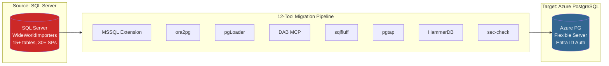
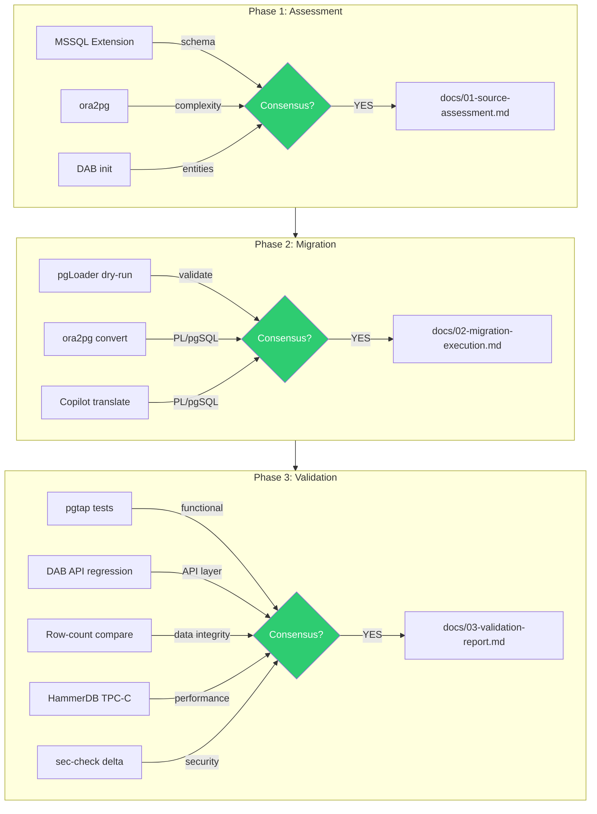

# SQL Server to PostgreSQL Migration Accelerator

A **language-agnostic, multi-tool** database migration accelerator that modernizes SQL Server databases to Azure Database for PostgreSQL Flexible Server. Built for DBAs and SSEs with a one-click Copilot agent.



## Quick Start

### Prerequisites

| Tool | Install | Purpose |
|---|---|---|
| Docker Desktop | [docker.com/products/docker-desktop](https://docker.com/products/docker-desktop) | Run SQL Server + PostgreSQL locally |
| VS Code | [code.visualstudio.com](https://code.visualstudio.com) | IDE |
| MSSQL Extension | `ext install ms-mssql.mssql` | Source DB inspection |
| PostgreSQL Extension | `ext install ms-ossdata.vscode-pgsql` | Target DB validation |
| GitHub Copilot | `ext install github.copilot` | Agent orchestration |

### Local Database Setup (Docker)

Spin up SQL Server 2022 + PostgreSQL 16 with WideWorldImporters pre-loaded:

```powershell
# One-click: starts containers, downloads backup (~120MB), restores database
.\scripts\setup-local-env.ps1
```

Or step by step:

```powershell
# 1. Start containers
docker compose up -d

# 2. Wait for SQL Server health check
docker compose ps   # both should show "healthy"

# 3. Restore WideWorldImporters (downloads .bak on first run)
.\scripts\setup-local-env.ps1
```

| Service | Host | Port | User | Password | Database |
|---|---|---|---|---|---|
| SQL Server 2022 | localhost | 1433 | sa | Str0ngP@ssw0rd! | WideWorldImporters |
| PostgreSQL 16 | localhost | 5432 | wwi_user | Str0ngP@ssw0rd! | wide_world_importers |

> **Note:** Passwords are in `.env` (gitignored). Change them for anything beyond local dev.

```powershell
# Stop containers (data persists in Docker volumes)
docker compose down

# Full reset (deletes volumes + data)
docker compose down -v
```

### Optional CLI Tools

| Tool | Install | Purpose |
|---|---|---|
| .NET 8+ Runtime | [get.dot.net](https://get.dot.net) | DAB CLI |
| DAB CLI | `dotnet tool install microsoft.dataapibuilder -g` | API layer + MCP |
| pgLoader | [pgloader.io](https://pgloader.io) | Bulk data migration |
| ora2pg | [ora2pg.darold.net](https://ora2pg.darold.net) | Assessment + auto-conversion |
| HammerDB | [hammerdb.com](https://hammerdb.com) | Cross-platform benchmarking |
| sqlfluff | `pip install sqlfluff` | PL/pgSQL linting |
| pgtap | [pgtap.org](https://pgtap.org) | PostgreSQL unit testing |
| SSMS 22 | [learn.microsoft.com/ssms](https://learn.microsoft.com/ssms) | Execution plan baseline |

### One-Click Migration

1. Open this repo in VS Code
2. Open Copilot Chat
3. Run: `/db-migrate samples/wide-world-importers`
4. The agent executes all 5 phases with multi-tool cross-validation

### Manual Phase Execution

```powershell
# Phase 1: Assess source database
.\scripts\run-assessment.ps1 -ConnectionString "Server=localhost;Database=WideWorldImporters;Trusted_Connection=True;"

# Phase 2: Execute migration
.\scripts\run-migration.ps1

# Phase 3: Validate results
.\scripts\validate-migration.ps1
```

## Architecture



## Multi-Tool Redundancy

Every critical step is validated by 2-3 independent tools:

| Step | Tool 1 | Tool 2 | Tool 3 |
|---|---|---|---|
| Schema Discovery | MSSQL ext | ora2pg | DAB |
| SP Translation | Copilot | ora2pg | sqlfluff + pgtap |
| Data Migration | pgLoader | DAB API regression | Row counts |
| Performance | SSMS 22 plans | HammerDB TPC-C | pgbench |
| Security | sec-check | Defender for DBs | CodeQL |

## Repo Structure

```
sql-to-postgres-migration/
|-- .github/
|   |-- agents/db-migration.agent.md      # Migration agent
|   |-- skills/sql-to-postgres/SKILL.md   # Single source of truth
|   |-- prompts/db-migrate.prompt.md      # One-click prompt
|   |-- rules/database-rules.md           # Architecture rules
|   |-- workflows/migration-ci.yml        # CI pipeline
|-- .vscode/
|   |-- mcp.json                          # GitHub MCP + DAB MCP
|   |-- extensions.json                   # Recommended extensions
|-- dab/                                  # Data API Builder configs
|-- docs/                                 # Generated phase results
|-- tests/                                # Security, performance, pgtap
|-- benchmarks/                           # HammerDB + pgbench configs
|-- security/                             # Security baselines + hardening
|-- scripts/                              # PowerShell automation
|-- samples/wide-world-importers/         # Demo database assets
|-- reference/                            # Cheatsheets + Azure best practices
|-- templates/                            # Reusable config templates
```

## Demo Database: WideWorldImporters

Microsoft's official SQL Server sample database. Ideal for DBA demos:
- **15+ tables** across Sales, Purchasing, Warehouse, Application schemas
- **30+ stored procedures** with complex business logic
- **Temporal tables** (system-versioned)
- **JSON columns** (custom data)
- **HIERARCHYID** and **GEOGRAPHY** types
- **Triggers** and **computed columns**

Download: [WideWorldImporters .bak](https://aka.ms/WideWorldImporters)

## Key Metrics

| Metric | Value |
|---|---|
| T-SQL patterns analyzed | 24 incompatible patterns |
| Security tests | 10 (sec-001 to sec-010) |
| Performance tests | 10 (perf-001 to perf-010) |
| Tools in pipeline | 12 cross-validating |
| MCP servers | 2 (GitHub + DAB) |
| Phases | 5 (3 core + 2 optional Fabric) |

## License

MIT
