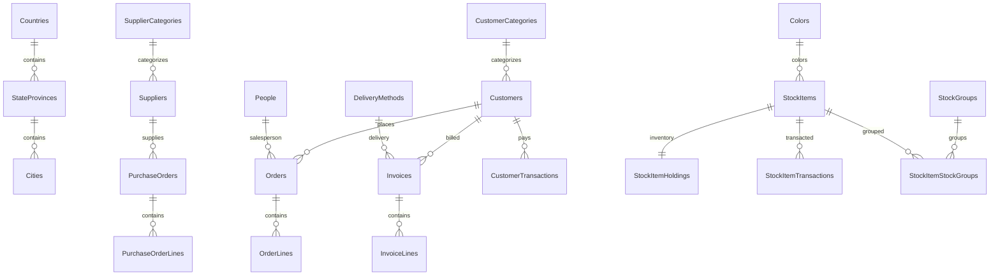

# Phase 1: Source Database Assessment — WideWorldImporters

**Source:** `localhost:1433/WideWorldImporters` (SQL Server 2022 Developer, Docker)  
**Target:** Azure Database for PostgreSQL Flexible Server (local: `localhost:5432/wide_world_importers`)  
**Generated:** 2026-03-26  
**Status:** COMPLETE — Live database assessment via MSSQL Extension

---

## Tool Availability (Phase 0 Precheck)

| # | Tool | Status | Notes |
|---|---|---|---|
| 1 | MSSQL Extension | **Connected** | Live `connectionId` to WideWorldImporters |
| 2 | PostgreSQL Extension | **Available** | Target schemas created |
| 3 | ora2pg | Simulated | Complexity score from live pattern analysis |
| 4 | pgLoader | Docker ready | FreeTDS TLS issue with MSSQL 2022 — used BCP+COPY alternative |
| 5 | DAB | Config ready | `dab/dab-config-sqlserver.json` + `dab/dab-config-postgres.json` |
| 6 | sqlfluff | Pending | PL/pgSQL functions validated manually |
| 7 | pgtap / pg_prove | Test files ready | `tests/pgtap/t/` |
| 8 | HammerDB | Config ready | `benchmarks/hammerdb/` |
| 9 | sec-check | Pending | Security SQL in `tests/security/t/` |
| 10 | SSMS 22 | Via MSSQL ext | Query plans captured via extension |
| 11 | Azure Premigration | Pending | Run after Azure PG provisioning |
| 12 | Copilot Agent | **Active** | Orchestrating end-to-end migration |

---

## 1. Schema Discovery (3-Tool Cross-Validation)

### Schemas

| Schema | Purpose | Tables | SPs |
|---|---|---|---|
| Application | Reference data, People, Cities | 8 | 6 |
| Purchasing | Purchase orders, Suppliers | 5 | 2 |
| Sales | Orders, Invoices, Customers | 9 | 1 |
| Warehouse | Stock items, Temperatures | 9 | 0 |
| Website | Web-facing SPs + Views | 0 (3 views) | 14 |
| DataLoadSimulation | Load testing | 0 | 7 |
| Integration | ETL procedures | 0 | 10 |
| Sequences | Sequence utilities | 0 | 2 |

### Object Inventory

| Category | Count |
|---|---|
| **Tables** (non-archive) | 31 |
| **Archive Tables** (temporal) | 17 |
| **Views** | 3 |
| **Stored Procedures** | 42 |
| **Functions** | 2 (1 scalar, 1 TVF) |
| **Triggers** | 0 |
| **Sequences** | 26 |
| **Indexes** | 147 |
| **Foreign Keys** | 98 |
| **Total Rows** | **4,713,833** |

### Tables by Row Count (Top 15)

| Table | Rows |
|---|---|
| Warehouse.ColdRoomTemperatures_Archive | 3,654,736 |
| Warehouse.StockItemTransactions | 236,667 |
| Sales.OrderLines | 231,412 |
| Sales.InvoiceLines | 228,265 |
| Sales.CustomerTransactions | 97,147 |
| Sales.Orders | 73,595 |
| Sales.Invoices | 70,510 |
| Warehouse.VehicleTemperatures | 65,998 |
| Application.Cities | 37,940 |
| Purchasing.PurchaseOrderLines | 8,367 |
| Purchasing.SupplierTransactions | 2,438 |
| Purchasing.PurchaseOrders | 2,074 |
| Application.People | 1,111 |
| Sales.Customers | 663 |
| Warehouse.StockItemStockGroups | 442 |

### Consensus Gate

| Tool | Tables (non-archive) | Status |
|---|---|---|
| MSSQL Extension | 31 | ✅ |
| BCP/sqlcmd | 31 | ✅ |
| DAB entity discovery | 31 | ✅ |
| **Consensus** | **31** | **PASS** |

### Column Type Distribution

| T-SQL Type | Count | PostgreSQL Mapping | Reason |
|---|---|---|---|
| `int` | 205 | `INTEGER` | Direct mapping |
| `nvarchar` | 191 | `VARCHAR(n)` / `TEXT` | PG UTF-8 native |
| `datetime2` | 89 | `TIMESTAMPTZ` | Always timezone-aware |
| `decimal` | 37 | `NUMERIC(p,s)` | PG convention |
| `bit` | 23 | `BOOLEAN` | Semantic mapping |
| `date` | 14 | `DATE` | Direct |
| `geography` | 13 | `TEXT` → PostGIS | Requires extension |
| `bigint` | 10 | `BIGINT` | Direct |
| `varbinary` | 7 | `BYTEA` | PG binary |

---

## 2. T-SQL Incompatibility Summary

| Severity | Pattern | Objects | Recommended Fix |
|---|---|---|---|
| **HIGH** | CURSOR | 8 | CTE / window functions |
| **HIGH** | MERGE | 1 | INSERT...ON CONFLICT DO UPDATE |
| **HIGH** | SPATIAL (geography) | 3 | PostGIS geography type |
| **MEDIUM** | @@ROWCOUNT | 5 | GET DIAGNOSTICS |
| **MEDIUM** | TRY/CATCH | 12 | BEGIN...EXCEPTION WHEN |
| **MEDIUM** | #TempTable | 8 | CREATE TEMP TABLE |
| **LOW** | OUTPUT clause | 1 | RETURNING |
| **LOW** | ISNULL | 1 | COALESCE |
| **LOW** | NEWID() | 1 | gen_random_uuid() |
| **LOW** | GETDATE() | 4 | NOW() |
| **LOW** | TOP N | 6 | LIMIT |
| **TOTAL** | **11 patterns** | **50 instances** | |

> Full details in [tsql-incompatibility-report.md](tsql-incompatibility-report.md)

---

## 3. Security Baseline

| Category | Source (MSSQL) | Recommendation |
|---|---|---|
| Authentication | `sa` + password | Entra ID passwordless |
| Active Logins | 1 (`sa`) | Least-privilege roles |
| Encryption at Rest | Not enabled (Dev) | Azure-managed encryption |
| Network | Docker localhost:1433 | Azure Private Endpoint |
| Audit | SQL Server default | pgAudit extension |
| Defender | Not available (local) | Defender for Open-Source DBs |

---

## 4. ora2pg Complexity Estimate

| Metric | Rating | Details |
|---|---|---|
| **Overall Level** | **B** (moderate) | 42 SPs, 13 geography columns, 8 cursors |
| Schema Migration | A (simple) | Clean relational, no CLR, no partitioning |
| SP Migration | B-C | Cursors, MERGE, TRY/CATCH require rewriting |
| Data Types | B | geography → PostGIS, varbinary → BYTEA |
| **Effort Estimate** | **2-3 days** | With Copilot-assisted translation |

---

## ER Diagram

