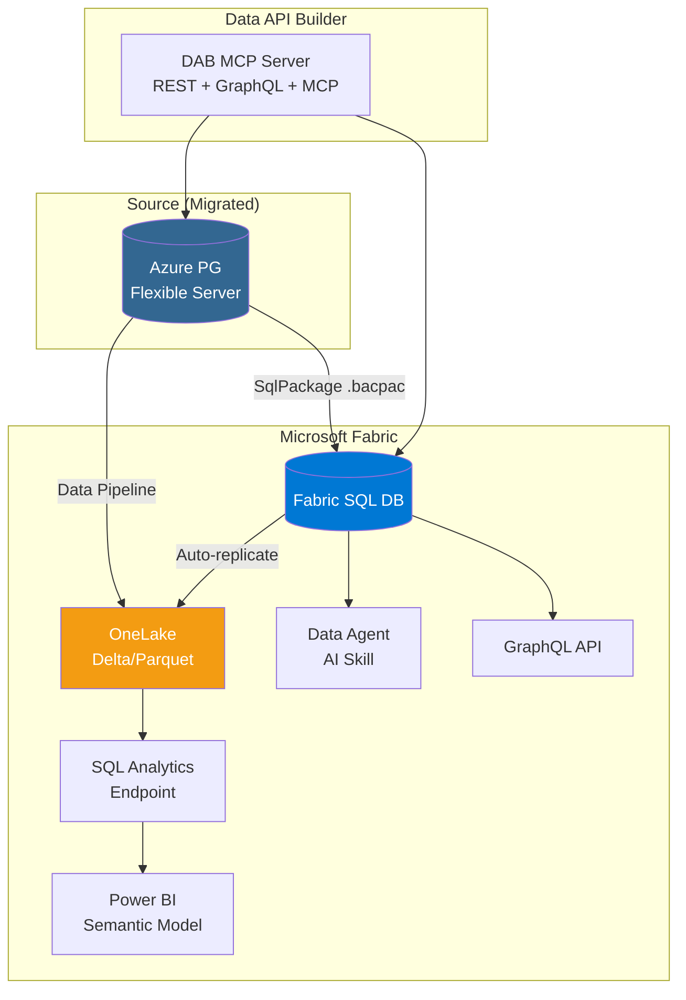

# Fabric Integration Architecture

Optional Phase 4-5: Integrating the migrated PostgreSQL database with Microsoft Fabric.

## Fabric Topology



## MSSQL Extension to Fabric

The same MSSQL extension that inspects the source SQL Server can connect to Fabric SQL DB:

```
Source: mssql_connect -> localhost SQL Server
Target: mssql_connect -> your-server.database.fabric.microsoft.com
```

Same tool, new connection string. Zero new tooling for the DBA.

## DAB on Fabric

DAB config points at Fabric SQL DB endpoint:
- Same REST/GraphQL/MCP surface
- Same entity definitions
- Same RBAC policies
- Different `database-type` and `connection-string`

See `dab/dab-config-fabric.json` for the template.
