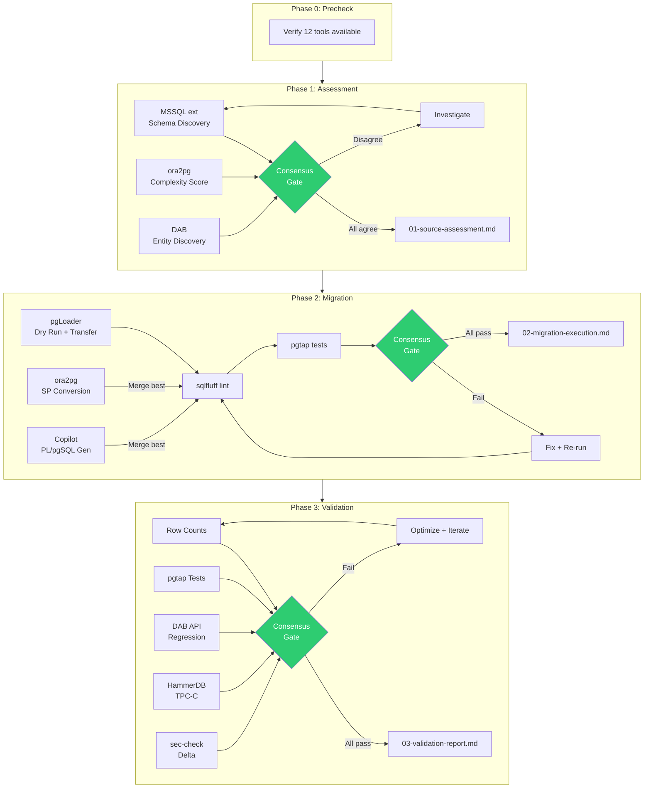
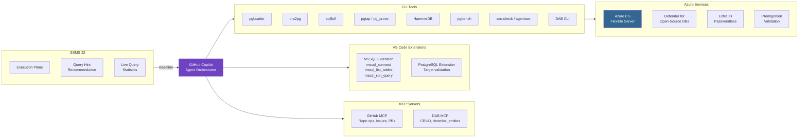
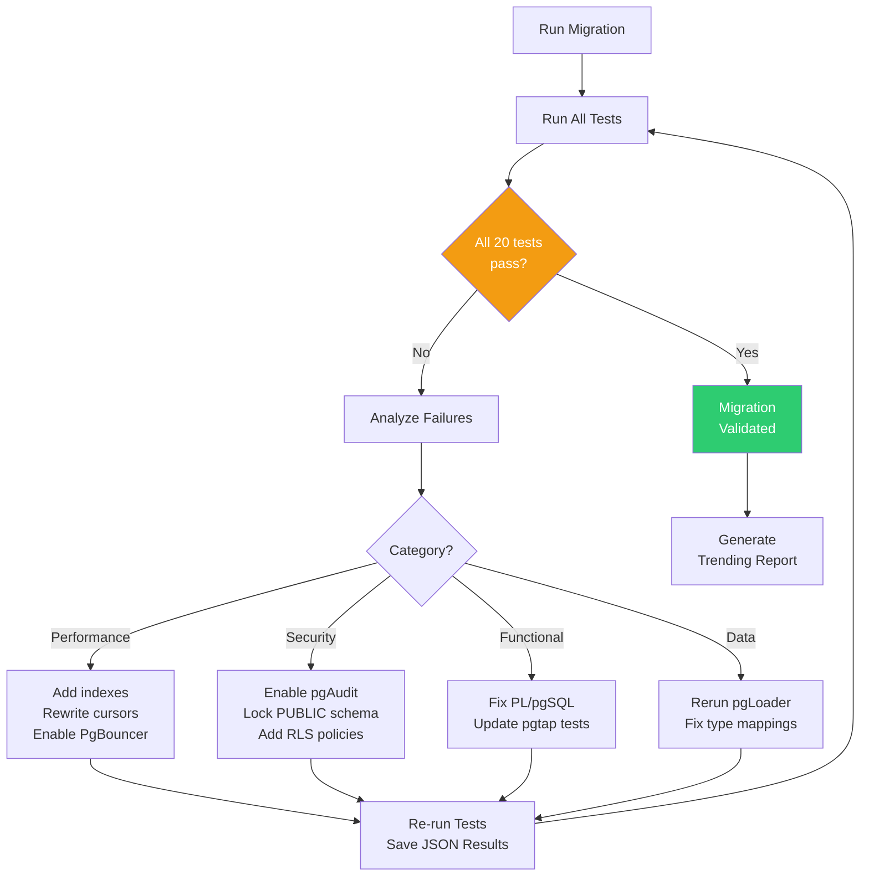

# Migration Flow Architecture

End-to-end Mermaid diagrams for the SQL Server to PostgreSQL migration pipeline.

## Overall Migration Pipeline

## Tool Integration Map

## Iteration Feedback Loop

