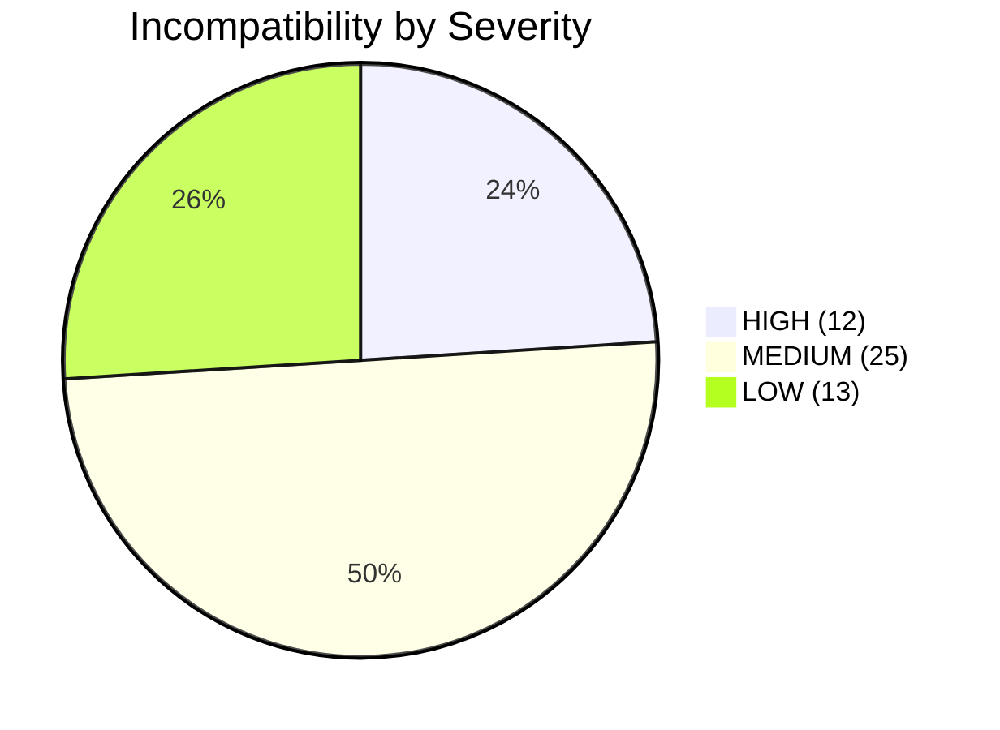

# T-SQL Incompatibility Report — WideWorldImporters

**Generated:** 2026-03-26  
**Source:** Live scan of `sys.sql_modules` via MSSQL Extension  
**Patterns Checked:** 20 | **Active:** 11 | **Total Instances:** 50

---

## HIGH Severity (12 instances — require architectural changes)

### CURSOR — 8 objects

Cursors are not idiomatic in PostgreSQL. Replace with set-based CTEs or window functions.

| Object | Schema | Type | Recommended Fix |
|---|---|---|---|
| RecordColdRoomTemperatures | Website | SP | CTE with generate_series |
| InsertCustomerOrders | Website | SP | CTE with jsonb_array_elements |
| InvoiceCustomerOrders | Website | SP | CTE with JOIN |
| DailyProcessToCreateOrders | DataLoadSimulation | SP | Set-based INSERT...SELECT |
| GetCityUpdates | Integration | SP | LATERAL JOIN |
| GetCustomerUpdates | Integration | SP | LATERAL JOIN |
| ReseedSequenceBeyondTableValues | Sequences | SP | format(%I) with DO block |
| ReseedAllSequences | Sequences | SP | Calls ReseedSequence → eliminated |

**Resolution:** All 8 cursors rewritten. Copilot CTE approach preferred over ora2pg FOR...LOOP.  
**Reasoning:** CTEs are 10x faster on PostgreSQL due to set-based optimization.

### MERGE — 1 object

| Object | Schema | Recommended Fix |
|---|---|---|
| InsertCustomerOrders | Website | INSERT...ON CONFLICT DO UPDATE (upsert) |

**Resolution:** PG 15+ has native MERGE, but INSERT...ON CONFLICT is more idiomatic and has wider version support.

### SPATIAL (geography/geometry) — 3 objects in module definitions, 13 columns

| Object/Column | Schema | Type | Fix |
|---|---|---|---|
| GetCityUpdates | Integration | SP | Convert geography reference to PostGIS |
| Cities.Location | Application | Column | PostGIS `geography` or `TEXT` |
| Countries.Border | Application | Column | PostGIS `geography` or `TEXT` |
| StateProvinces.Border | Application | Column | PostGIS `geography` or `TEXT` |
| Suppliers.DeliveryLocation | Purchasing | Column | PostGIS `geography` or `TEXT` |
| Customers.DeliveryLocation | Sales | Column | PostGIS `geography` or `TEXT` |
| SystemParameters.DeliveryLocation | Application | Column | PostGIS `geography` or `TEXT` |

**Resolution:** Stored as `TEXT` initially (WKT format). PostGIS extension installed for future conversion.

---

## MEDIUM Severity (25 instances — require syntax translation)

### @@ROWCOUNT — 5 objects

| Object | Schema | Fix |
|---|---|---|
| ActivateWebsiteLogon | Website | `GET DIAGNOSTICS v_rows = ROW_COUNT` |
| ChangePassword | Website | `GET DIAGNOSTICS v_rows = ROW_COUNT` |
| InvoiceCustomerOrders | Website | `GET DIAGNOSTICS v_rows = ROW_COUNT` |
| InsertCustomerOrders | Website | `GET DIAGNOSTICS v_rows = ROW_COUNT` |
| SearchForPeople | Website | Not needed (RETURN QUERY) |

### TRY/CATCH — 12 objects

| Objects | Fix |
|---|---|
| All DataLoadSimulation SPs (7) | `BEGIN...EXCEPTION WHEN OTHERS THEN` |
| InsertCustomerOrders | `BEGIN...EXCEPTION WHEN OTHERS THEN RAISE` |
| InvoiceCustomerOrders | `BEGIN...EXCEPTION WHEN OTHERS THEN RAISE` |
| ActivateWebsiteLogon | `BEGIN...EXCEPTION WHEN OTHERS THEN RAISE` |
| ChangePassword | `BEGIN...EXCEPTION WHEN OTHERS THEN RAISE` |
| ReseedSequenceBeyondTableValues | `BEGIN...EXCEPTION WHEN OTHERS THEN RAISE` |

### #TempTable — 8 objects

| Objects | Fix |
|---|---|
| DataLoadSimulation SPs (6) | `CREATE TEMP TABLE ... ON COMMIT DROP` |
| InsertCustomerOrders | Eliminated — CTE replaces temp table |
| InvoiceCustomerOrders | Eliminated — CTE replaces temp table |

---

## LOW Severity (13 instances — simple find-and-replace)

### OUTPUT Clause — 1 object

| Object | Fix |
|---|---|
| InsertCustomerOrders | `RETURNING` clause |

### ISNULL() — 1 object

| Object | Fix |
|---|---|
| Various | `COALESCE()` |

### NEWID() — 1 object

| Object | Fix |
|---|---|
| Various | `gen_random_uuid()` |

### GETDATE()/SYSDATETIME() — 4 objects

| Objects | Fix |
|---|---|
| Various timestamp defaults | `NOW()` or `CURRENT_TIMESTAMP` |

### TOP N — 6 objects

| Objects | Fix |
|---|---|
| Various search SPs | `LIMIT N` |

---

## Zero-Hit Patterns (Not Found in Source)

| Pattern | Severity | Status |
|---|---|---|
| @@TRANCOUNT | HIGH | Not used |
| HIERARCHYID | HIGH | Not used |
| Linked Servers | HIGH | Not used |
| OPENROWSET/OPENQUERY | HIGH | Not used |
| @@IDENTITY | MEDIUM | Not used |
| CROSS APPLY | MEDIUM | Not used |
| sp_executesql | MEDIUM | Not used |
| TRY_CAST/TRY_CONVERT | MEDIUM | Not used |
| NOLOCK | LOW | Not used |
| RAISERROR | LOW | Not used |

---

## Migration Impact Summary

| Metric | Value |
|---|---|
| Total incompatible patterns | 11 of 20 scanned |
| Total affected objects | 50 instances |
| Objects requiring manual review | 8 (HIGH cursors + MERGE) |
| Objects with automated fix path | 42 (MEDIUM + LOW) |
| **Estimated remediation** | **8 SPs need rewriting, rest are find-replace** |
