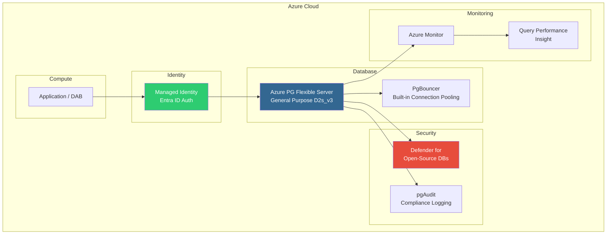

# Azure Architecture Center Best Practices

This document cites specific Azure Architecture Center guidance applied to this migration.

## 1. Data Management Best Practices

**Source:** [Azure Architecture Center - Databases](https://learn.microsoft.com/en-us/azure/architecture/databases/)

- Choose the right data store for each workload
- Use managed services (Azure PG Flexible Server) over IaaS VMs
- Design for high availability with zone-redundant configurations

## 2. Azure Well-Architected Framework - Data Pillar

**Source:** [Well-Architected Framework](https://learn.microsoft.com/en-us/azure/well-architected/)

### Reliability
- Zone-redundant high availability on Azure PG Flexible Server
- Point-in-time restore (PITR) for data recovery
- Connection retry with exponential backoff (EnableRetryOnFailure)

### Security
- Entra ID passwordless authentication (no SQL passwords)
- pgAudit for compliance audit logging
- Microsoft Defender for Open-Source Relational Databases
- Network isolation via Private Link or VNet integration
- Row-level security (RLS) for multi-tenant data

### Cost Optimization
- Open-source PostgreSQL eliminates per-core licensing ($15K+/year savings)
- Burstable tier for dev/test ($25/month vs $400+/month SQL MI)
- Stop/start capability for non-production workloads
- PgBouncer built-in connection pooling (no separate proxy needed)

### Operational Excellence
- Azure PG Intelligent Tuning (auto-vacuum, auto-index)
- Query Performance Insight in Azure Portal
- pg_stat_statements for query-level metrics
- Azure Monitor integration for alerting

### Performance Efficiency
- HiLo sequences for batch insert optimization
- Partial indexes (more flexible than SQL Server filtered indexes)
- `tsvector` + GIN indexes for full-text search (built-in, no separate FT catalog)
- Connection pooling via built-in PgBouncer

## 3. PostgreSQL Flexible Server Reference Architecture

**Source:** [Azure Database for PostgreSQL - Flexible Server](https://learn.microsoft.com/en-us/azure/postgresql/flexible-server/overview)

## 4. Migration Service Best Practices

**Source:** [Best practices for migration to Azure PG](https://learn.microsoft.com/en-us/azure/postgresql/migrate/migration-service/best-practices-migration-service-postgresql)

- Run premigration validation before actual migration
- Allocate 1.25x storage on target (WAL generation during migration)
- Use powerful SKU during migration, scale down after
- Validate with row counts, max/min IDs, and object counts (not database size)
- Plan for 7-day maximum migration lifetime
